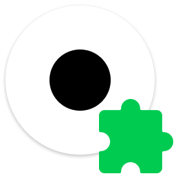

    

<h2 align="center">Dot Browser Extensions</h2>

    The repository of extensions used in Dot Browser.
     
    <a href="#">Adblocker</a>
    · <a href="#">Director</a>
    · <a href="#">Union</a>
    · <a href="#">Postbox</a>

 

---

|  | Extensions |
| - | ------------ |
| 🚫 | **Adblocker** is a blazingly fast adblocker made in Rust. |
| 🤵 | **Director** is an extension which redirects social media sites to private alternatives. |
| 🤝 | **Union** allows you to install WebExtensions from 3rd party extension stores. |
| 📮 | **Postbox** is an extension which generates temporary emails to mask your identity and block spam. |

## 🤝 Contributors
- [EnderDev](https://github.com/EnderDev) - ***Main Developer***

## 💸 Donations
We accept donations on [Patreon](https://patreon.com/dothq) to keep our servers running.

## 📜 Licenses
**Dot Browser Extensions** are licensed under the [MPL-2.0](https://www.mozilla.org/en-US/MPL/2.0) license.